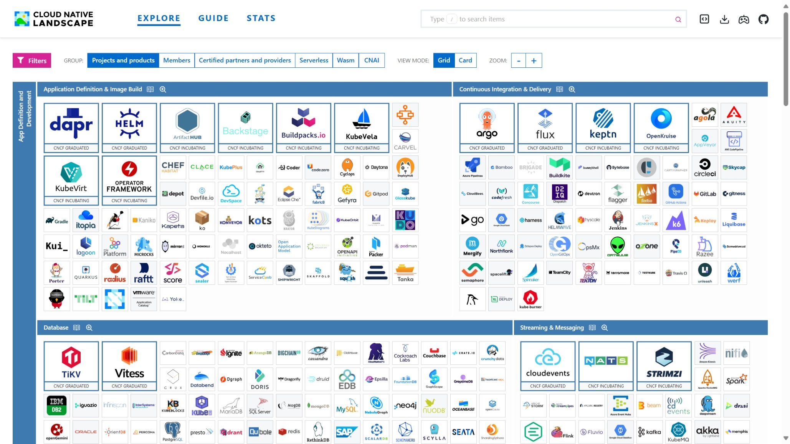
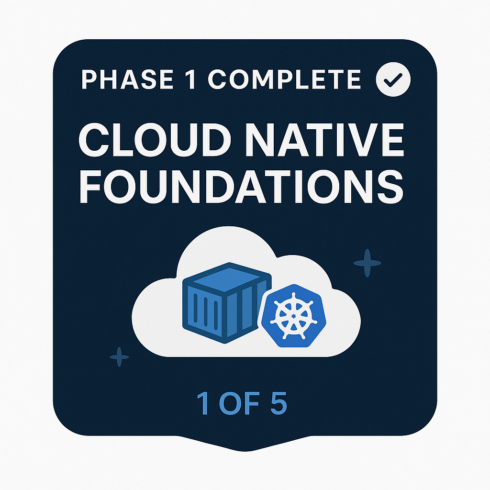

## What *Is* Cloud Native, and Why Should You Care?

Hey there, and welcome 👋

If you’ve been hearing the term *cloud native* everywhere — in meetups, job descriptions, tech podcasts, or even Kubernetes docs — but you’re still not quite sure what it really means, you’re in the right place.

This guide is here to **demystify cloud native from the ground up**. No buzzwords, no hype — just a clear, practical introduction to what it is, why it matters, and how it’s reshaping the way we build and run software today.

Whether you’re here out of curiosity, or you’re preparing for the **Kubernetes and Cloud Native Associate (KCNA)** certification, this is the first step on your journey. We’ll walk through the big ideas, unpack confusing terms, and set you up with the right mental models for everything that comes next — including containers, orchestration, Kubernetes, and beyond.

By the end of this lesson, you'll understand:
- What cloud native really means (beyond the buzz)
- Why organisations are moving in this direction
- What technologies are involved — and how they fit together
- What mindset shift this movement requires

Sound good? Let’s dive in and start from the beginning — what does *cloud native* actually mean?

## What Is Cloud Native?

Let’s start with the big question: **what exactly is cloud native?**

You’ve probably heard the term in job interviews, blog posts, or tech conference talks — often with excitement, sometimes with confusion. It’s one of those phrases that sounds important, but can feel a bit… vague.

So let’s break it down together — clearly and practically.

### Cloud Native: Built *For* the Cloud, Not Just *In* the Cloud

Cloud native isn’t just about using the cloud — it’s about building applications that **are designed from the ground up** to thrive in a cloud environment.

Think of it this way:

> Traditional applications are like carefully built houses — stable, long-lasting, but hard to rearrange once built.  
> Cloud native apps are like modular furniture — flexible, easy to scale up or tear down, and designed to adapt as needs change.

In cloud native systems:
- Apps are broken into **small, independent parts** (called *microservices*)
- Each part runs in a **container**, making it portable and consistent
- Containers are managed by orchestration tools like **Kubernetes**
- The whole system is described through **declarative configs**, not manual setup steps

The result? Apps that are:
- Easier to scale
- Faster to deploy
- More resilient to failure

### CNCF's Definition (The Official One)

The **Cloud Native Computing Foundation (CNCF)** — the organisation behind Kubernetes and many other open source projects — defines cloud native like this:

> “Cloud native technologies empower organizations to build and run scalable applications in modern, dynamic environments such as public, private, and hybrid clouds.”

It’s a bit of a mouthful, but the core idea is:  
👉 Cloud native isn’t just a toolset — it’s a **mindset and architectural approach** to building software in the modern cloud.

### Why This Matters (Especially for KCNA)

Understanding cloud native is foundational to making sense of:
- Why **Kubernetes** exists
- Why **containers** are everywhere
- Why **declarative APIs** and **orchestration** matter

You’ll also start to hear words like:
- **Resilience** (how systems recover from failure),
- **Automation** (letting the system manage itself), and
- **Composability** (building systems from modular, reusable parts)

Don’t worry if those sound a bit abstract for now.  
You’ll see real-world examples of each one as we go — and they’ll all click into place as part of the bigger picture.

For now, just remember: cloud native is about **building smarter, faster, and more adaptable systems** — and that’s the mindset we’re about to explore through tools like containers and Kubernetes.

## Meet the CNCF: The Foundation Behind Cloud Native

So now that we’ve explored what *cloud native* means, it’s time to meet the organisation that’s been driving this whole movement: the **Cloud Native Computing Foundation** — or CNCF for short.

You’ll see this name everywhere in the cloud native world.  
They maintain Kubernetes. They define cloud native principles.  
They curate the tools, projects, and best practices that fuel this ecosystem.

So who are they really? And why should you care?

### A Vendor-Neutral Foundation for Cloud Native Innovation

The CNCF was launched in 2015 as part of the **Linux Foundation**.  
Its mission is simple and ambitious:  
> *Make cloud native computing universal and accessible to everyone.*

To do that, they:
- **Host open-source projects** like Kubernetes, Prometheus, and Envoy
- **Provide vendor-neutral governance**, so no single company controls the technology
- **Run community events** like KubeCon and CloudNativeCon
- **Offer certifications** like KCNA and CKA to grow the next generation of engineers

If you're studying for KCNA, you’re already walking through one of their learning paths — and that puts you in good company. You're learning what thousands of professionals and teams around the world are adopting too.

### The CNCF Ecosystem: Open Standards and Interoperability

What makes cloud native tech special isn’t just the tools — it’s how they **interconnect**.

The CNCF promotes a modular, plug-and-play ecosystem built around **open interfaces**:

- **OCI (Open Container Initiative)** – standard for container images and runtimes  
- **CNI (Container Network Interface)** – standard for how containers get networking  
- **CSI (Container Storage Interface)** – standard for volume and storage management  
- **CRI (Container Runtime Interface)** – how Kubernetes interacts with container runtimes

These interfaces allow flexibility. You can swap runtimes, plug in different network providers, or integrate new storage layers — all without breaking Kubernetes or rewriting your apps.

This design makes the ecosystem **extensible**, **resilient**, and **truly open**.

### The CNCF Landscape (Yes, It’s a Lot)

To visualise how many tools are part of this ecosystem, take a look at the CNCF Landscape:



Every logo you see here represents a real open-source project that fits somewhere in the cloud native journey — from databases and messaging queues, to service meshes, CI/CD platforms, observability tools, and more.

Feeling overwhelmed? That’s okay.  
You’re not meant to know them all.  
KCNA only asks for broad awareness of **why** this ecosystem exists and **how** it works together — not deep mastery of every tool.

### How CNCF Categorises Projects

To help make sense of this wild ecosystem, the CNCF groups projects into three stages:

| Stage       | Meaning                                                                 |
|-------------|-------------------------------------------------------------------------|
| **Graduated** | Mature, widely used projects with strong governance (e.g. Kubernetes) |
| **Incubating** | Growing projects that have proven real-world adoption                 |
| **Sandbox**   | Early-stage experiments with potential, but still maturing             |

In KCNA, you won’t need to memorise every category, but it helps to recognise **Kubernetes, Prometheus, Envoy, containerd, Helm, and Flux** as major CNCF projects — many of which are *Graduated*.

### Optional: Trail Map vs. Landscape

If you want a curated learning sequence instead of a full landscape, CNCF also provides a [**Trail Map**](https://github.com/cncf/trailmap). It’s like a beginner-friendly guide through the cloud native jungle — starting with containers and orchestration, and working toward service mesh, observability, and security.

### What This Means for You

As someone learning cloud native (or preparing for KCNA), the CNCF isn’t just a logo — it’s your home base.

They:
- Define the standards
- Maintain the tools
- Support the community
- Help people like you grow into this space

And now that you know who they are and what they do, you’re ready to explore the technical traits that make cloud native apps so powerful.

Next up: the four key characteristics of cloud native applications.

## What Makes an Application *Cloud Native*?

Now that we know what cloud native means and who’s championing it, let’s get a bit more practical.

When someone says “this app is cloud native,” what do they really mean?  
What makes it *different* from a traditional monolith running on a server?

At its core, a cloud native application has four key traits — and each one plays a role in how it scales, adapts, and survives in today’s cloud environments.

Let’s break them down.

### 1. Microservices: Break It Down to Build It Better

Instead of building one big application that does everything (known as a **monolith**), cloud native systems are made of many **small, focused services** — each doing one thing well.

For example:
- A shopping site might have a login service, a product catalog service, a checkout service — all separate and independently deployable.

Each service is developed, deployed, and scaled **on its own**. That means:
- Faster updates
- Less risk of breaking everything at once
- Teams can work in parallel

In KCNA terms, this helps you understand why **modular design** matters when building and orchestrating workloads.

### 2. Containers: Consistency Everywhere

Now that we have all these microservices… how do we package and run them?

Enter **containers**.

A container wraps your code together with everything it needs to run: its libraries, dependencies, and runtime. That way, your app runs **the same way on every machine**, whether it’s your laptop or a cloud data center.

If you’ve ever heard the phrase, “But it worked on my machine!” — containers are the solution to that problem.

Containers are:
- Lightweight
- Portable
- Fast to start
- Easy to scale

And most of the time, they’re built and run using tools like **Docker** and **containerd** — both of which are part of the CNCF landscape.

### 3. Dynamic Orchestration: Let the System Handle the Work

Once you have dozens — or even hundreds — of containers running your microservices, someone (or something) has to keep it all running smoothly.

That “something” is **orchestration** — and in cloud native, that usually means **Kubernetes**.

Kubernetes automates:
- Where containers run
- When to scale them up (or down)
- How to restart them if they crash
- How to connect them through services and networking

This is what makes cloud native systems **self-healing** and **elastic** — they can respond to change without you manually intervening.

And when you hear about “desired state” in Kubernetes, that’s orchestration in action:  
> *You tell the system what you want — and it works continuously to make it true.*

### 4. Declarative APIs: You Say *What*, Not *How*

This one might feel abstract at first, but it’s a powerful concept.

In cloud native systems, you don’t write scripts that say “step 1, do this; step 2, do that.”  
Instead, you **declare what the end state should be**, and the system figures out how to make it happen.

In Kubernetes, you might declare:
```yaml
replicas: 3
```
…and the system ensures three containers are running — restarting or rescheduling them as needed.

This is called **declarative configuration**, and it’s a huge part of how Kubernetes and other cloud native tools achieve automation and reliability.

### Recap: The Four Traits of Cloud Native Apps

Cloud native apps are:
1. **Modular** – built with **microservices**
2. **Portable** – packaged as **containers**
3. **Automated** – managed by **orchestration systems** like Kubernetes
4. **Declarative** – configured using **intent-driven APIs**

These traits aren’t just buzzwords — they’re what make modern applications **scalable, resilient, and fast-moving**.

Next up, we’ll explore the real-world **benefits** of this approach — and why so many companies are betting on cloud native.

## Why Cloud Native? The Real-World Benefits

By now, you’ve learned what makes an app cloud native — from its modular design to its use of containers, orchestration, and declarative APIs.

But here’s the big question:
> **Why go through all this trouble?**  
> What do you actually *gain* from building applications this way?

Let’s break it down. Here are the reasons so many companies — from scrappy startups to global enterprises — are betting on cloud native.

### 1. Scalability and Resilience: Built to Adapt

In cloud native systems, every part of your application — each microservice, each container — can **scale independently**.

So when demand spikes (like Black Friday on an e-commerce site), you don’t have to scale *everything*. You can just scale the services that are under pressure — like your checkout or search service — and leave the rest untouched.

And if something fails? The system replaces it automatically.  
That’s **self-healing** in action — and it’s one of the biggest reasons teams love Kubernetes.

### 2. Faster Development and Deployment: Speed Wins

Because cloud native apps are split into microservices, teams can:
- Work in parallel on different services
- Test and deploy independently
- Release smaller updates more frequently

You don’t need to wait weeks to ship a feature — you can release changes continuously, with less risk.

And thanks to containers, your app behaves the same way from development to production — no more “it worked on my laptop” surprises.

### 3. Cost Efficiency: Only Pay for What You Use

Cloud native systems run on **elastic infrastructure** — which means they grow or shrink automatically based on load.

Instead of running 20 servers all day "just in case," your workloads can scale *only when needed*, and idle when demand drops.

This isn’t just good engineering — it’s good economics.  
You save money by using **just enough compute** at the right time.

### 4. Vendor Neutrality: You're Not Locked In

Cloud native tools are built on **open standards** and run on **any cloud** — public, private, or hybrid.

That means you're not locked into one cloud provider, one vendor, or one stack.  
You can mix and match best-in-class tools and migrate between environments when needed.

This flexibility is crucial for companies that want to:
- Avoid vendor lock-in
- Build portable systems
- Keep their options open as technology evolves

### Real Results, Not Just Hype

The benefits of cloud native aren’t theoretical — they’re **real, measurable advantages**:
- Faster time to market
- Fewer outages
- Lower ops overhead
- Happier dev teams
- Better use of cloud infrastructure

It’s no wonder that many KCNA-aligned projects — like Kubernetes, Prometheus, and containerd — have become global standards in how modern apps are built and run.

But — it’s not all smooth sailing. Like any major shift in tech, cloud native comes with **challenges** too.

And that’s exactly what we’ll talk about next.

## Challenges of Cloud Native: What You Need to Know

So far, cloud native probably sounds like a dream:  
- Modular apps  
- Self-healing systems  
- Fast deployments  
- Cost savings  
- No vendor lock-in  

But — let’s be honest.

Like any major shift in how we build software, **cloud native comes with challenges** too.  
The benefits are real, but they don’t come for free. There’s a learning curve, some cultural adjustment, and a few architectural puzzles to solve along the way.

Let’s walk through the most common challenges — and why they’re worth facing.

### 1. Complexity: Many Moving Parts

The moment you move from a monolith to a cloud native system, you trade one big block for **many smaller parts** — microservices, containers, config files, network rules, secrets, service discovery, orchestration layers… the list goes on.

That means:
- More things to monitor
- More connections to secure
- More decisions to make

And while tools like Kubernetes help you manage this complexity, they also introduce their own learning curves.

📌 *What this means for you:*  
Expect to juggle **multiple concepts** at once.  
But don’t worry — we’ll build them step by step.

### 2. Security: More Pieces, More Surfaces

In a cloud native system:
- Each microservice talks to others across the network  
- Each container runs its own dependencies  
- Data moves between layers constantly

This introduces **new attack surfaces** — not just the app, but the container, the orchestrator, the network, and the pipeline.

Securing a cloud native stack means thinking about:
- **Authentication and authorisation** (Who can access what?)
- **Image scanning** (Is this container safe?)
- **Network policies** (Who can talk to whom?)

It’s not harder — it’s just *different* than traditional perimeter security.

### 3. Cultural & Organisational Shifts: Not Just Tech

Cloud native isn’t just about tools — it’s about **how teams work**.

You’ll hear words like:
- **DevOps** (developers and operations working together)
- **Shift left** (testing and security earlier in the lifecycle)
- **Platform teams** (internal teams that provide shared infrastructure to others)

Moving to cloud native often means:
- Breaking down silos between teams
- Learning to release software faster
- Giving developers more responsibility — and more ownership

It’s not always comfortable at first. But the payoff is worth it.

### 4. Monitoring and Debugging: Harder Before It Gets Better

In a monolith, if something breaks, you look at the logs.

In a cloud native system?
- You have logs for *each microservice*
- Each container may spin up, shut down, and restart in seconds
- Tracing an error might mean following it through five different services

This is where **observability tools** come in — things like **Prometheus, Grafana, and distributed tracing**.

Don’t worry — we’ll get to those. For now, just know that traditional debugging tools often fall short in distributed systems.

### Why We Still Do It

It’s okay to feel overwhelmed by cloud native at first. Everyone does.

But here’s the thing:
- The **challenges are real**, yes.
- But so are the **tools, communities, and best practices** that help solve them.
- And you’re not expected to understand everything on day one.

Cloud native is a **journey** — and you’re already on it.

The good news?  
You don’t have to tackle it all at once.  
With the right learning path (like this one 😉), you’ll move from confusion to clarity, one lesson at a time.

Next up, let’s wrap it all up — and get ready for the next leg of the KCNA journey.

## Wrapping Up: Cloud Native, from Buzzword to Foundation

Congratulations — you’ve just taken your first real step into the cloud native world.

In just a few sections, you’ve gone from hearing the phrase *cloud native* to understanding:
- What it actually means (beyond the hype)
- Why it’s reshaping how we build and ship software
- What makes an app cloud native — and how Kubernetes, containers, and declarative APIs all play a role
- Who’s leading this movement (hello, CNCF 👋)
- And yes, even the **challenges** that come with all this power

That’s no small feat — and if some parts still feel fuzzy, that’s normal. You’re not supposed to know everything yet. You’re *building context*, and it’s starting to click.

### KCNA Concepts You Just Covered

By reading this far, you’ve already covered a surprising amount of KCNA exam content:

- ✅ **Definition of Cloud Native** (CNCF-aligned)
- ✅ **CNCF’s role** as a vendor-neutral project host
- ✅ **Four traits of cloud native applications**
- ✅ Introduction to **microservices** and **containers**
- ✅ The value of **declarative APIs** and **orchestration**
- ✅ Importance of **CRI**, **CNI**, and **CSI** as open interfaces
- ✅ Awareness of the **CNCF landscape**, project maturity levels, and the broader ecosystem

You didn’t just read a blog post — you built a solid foundation for certification and real-world understanding.

### So, What’s Next?

Now that you’ve seen the big picture, it’s time to zoom in — to the **smallest unit of cloud native execution**: the **container**.

Before we dive into Kubernetes (don’t worry, we’re getting there!), we need to answer some key questions:
- What *is* a container?
- Why are containers more than just “lightweight VMs”?
- What problems do they solve — and how do they work behind the scenes?

Once you understand containers, you’ll see why Kubernetes exists in the first place — and how all these moving parts fit together like a well-designed system.

### Ready for Real Momentum?

The next phase of this journey will be hands-on, visual, and grounded in examples. You’ll:
- Build your first container
- Understand what’s inside an image
- Learn the difference between a container and a runtime
- See how Docker, containerd, and OCI fit together

This is where theory meets experience — and your confidence starts to build.

So take a breath. You’ve already made real progress.  
Let’s keep going — one container at a time.

